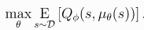

# Project 3: Collaboration and Competition
* [Introduction](#introduction)
* [Learning Algorithm](#learning-algorithm)   
* [Project Structure](#project-structure)   
* [Implementation](#implementation)   
* [Results](#results)   
* [Future work](#ideas-for-future-work)

## Introduction

In real life, each human interacts with other humans and the enviroment. This is also true for artifical intelligence. AI needs to interact with humans and other agents in a safe and efficient way.  E.g. autonomous systems as cars must interact with many different kind of agents. 

Reinforcement learning shows the most promise to solve this task.
This project will demonstrate how two agents can work together in a colleboration and competive setting. 

In this environment, two agents control rackets to bounce a ball over a net. If an agent hits the ball over the net, it receives a reward of +0.1. If an agent lets a ball hit the ground or hits the ball out of bounds, it receives a reward of -0.01. Thus, the goal of each agent is to keep the ball in play.


## Learning Algorithm

> DDPG combines the actor-critic approach with the insights from the Deep Q Network. DQN learn value functions 
> using deep neural networks in a stalbe and robust way. They utilize a replay buffer to minimize correlations between samples
> and a target Q network. DDPG is model free, off policy actor-critic algorithm that can learn high-dimensional, continuous action spaces.  
> The authors of the [the paper](https://arxiv.org/pdf/1509.02971.pdf) highlight that DDPG can be viewed as an extension of Deep Q-learning to continuous tasks.


* **Policy-based**: Unlike its value-based counterparts (like DQN), this method tries to
  learn the policy that the agent should use to maximize its objective directly. Recall
  that value-based methods (like Q-learning) try to learn an action-value function 
  to then recover the implict policy (greedy policy).

* **Actor-critic**: Actor-critic methods leverage the strengths of both policy-based and value-based methods.
  Using a policy-based approach, the agent (actor) learns how to act by directly estimating the optimal policy and maximizing reward through gradient ascent.     
  Meanwhile, employing a value-based approach, the agent (critic) learns how to estimate the value (i.e., the future cumulative reward) of different state-action 
  pairs. Actor-critic methods combine these two approaches in order to accelerate the learning process. Actor-critic agents are also more stable than value-based 
  agents, while requiring fewer training samples than policy-based agents.

* **Model-free**: We do not need access to the dynamics of the environment. This algorithm
  learns the policy using samples taken from the environment. We learn the action-value function
  (critic) by using *Q-learning* over samples taken from the world, and the policy by
  using the *Deterministic Policy Gradients* theorem over those samples.

* **Off-policy**: The sample experiences that we use for learning do not necessarily come
  from the actual policy we are learning, but instead come from a different policy (exploratory
  policy). As in DQN, we store these experiences in a replay buffer and learn from
  samples of this buffer, which might come from different timesteps (and potentially from
  different versions of the exploratory policy).
  
  Here are some advantages of policy-based methods:
- **Continuous action spaces** &mdash; Policy-based methods are well-suited for continuous action spaces.
- **Stochastic policies** &mdash; Both value-based and policy-based methods can learn deterministic policies. However, policy-based methods can also learn true stochastic policies.
- **Simplicity** &mdash; Policy-based methods directly learn the optimal policy, without having to maintain a separate value function estimate. With value-based methods, the agent uses its experience with the environment to maintain an estimate of the optimal action-value function, from which an optimal policy is derived. This intermediate step requires the storage of lots of additional data since you need to account for all possible action values. Even if you discretize the action space, the number of possible actions can get quite large. And, using DQN to determine the action that maximizes the action-value function within a continuous or high-dimensional space requires a complex optimization process at every timestep.
  
In DDPG the actor is the policy based part and the critic is the Q-learning part. 
To learn the actor function <a href="https://www.codecogs.com/eqnedit.php?latex=\mu(s|\theta^Q)" target="_blank"></a> the DDPG algorithm performs gradient ascend w.r.t parameters to solve 




The critic Q(s,a) can learned by considering the Bellman equation


which describes the optimal action value function. 
The loss function to learn the optimal action value function is 


This mean squared loss function provides us with the information, how close the critic Q(s,a) comes to fullfill the Bellman equation. 

To explore the continous action space, a exploration policy is used:

<a href="https://www.codecogs.com/eqnedit.php?latex=\mu'&space;=&space;\mu(s|\theta^Q)&space;&plus;&space;\mathcal{N}" target="_blank"></a>

This policy adds to action from the actor function a noise sampled from a noise process. 

After we have covered the ideas behind the DDPG here is the full algorithm 

  
  
## Project Structure

The code is written in PyTorch and Python3, executed in Jupyter Notebook

- Tennis.ipynb	: Training and evaluation of the agents
- ddpgagent.py	: An agent that implement the DDPG algorithm
- magent.py : Implementation of multiple agents for this task. Uses the DDPG-agent
- models.py	: DNN models for the actor and the critic
- replaybuffer.py : Implementation of experience replay buffer
- checkpoint.pt : parameters for actor/critic network


## Implementation

To solve this task, I decided to stick with the DDPG algorithm. Since the agents collaborate and compete, we can't apply direct the algorithm. Therefore a wrapper class `MultiAgent' exists. This class supports the action selection and the learning. Internal this class uses two DDPG-agents and a shared experienc buffer for the agents. The DDPG agent and the replay buffer is based on the classes from the continous control project.

### Models


#### Actor

The actor model consists of three layers. The activation function relu is used for the hidden layers. 
For the output layer tanh as activation function was used. 

```
ActorModel(
  (fc1): Linear(in_features=24, out_features=256, bias=True)
  (fc2): Linear(in_features=256, out_features=128, bias=True)
  (fc3): Linear(in_features=128, out_features=2, bias=True)
)
```

#### Critic

The critic model uses also three layers and relu as activation function for the hidden layers. 
For the output layer no activation function was used. 

```
CriticModel(
  (fc1): Linear(in_features=24, out_features=256, bias=True)
  (fc2): Linear(in_features=258, out_features=128, bias=True)
  (fc3): Linear(in_features=128, out_features=1, bias=True)
)
```

#### Exploration vs Exploitation
One challenge is choosing which action to take while the agent is still learning the optimal policy. Should the agent choose an action based on the rewards observed thus far? Or, should the agent try a new action in hopes of earning a higher reward? This is known as the **exploration vs. exploitation dilemma**.

The the exploration vs. exploitation dilemma is addressed with an  𝛆-greedy algorithm in the navigation project. 
For this project the **Ornstein-Uhlenbeck process** is implemented. 

The Ornstein-Uhlenbeck process itself has three hyperparameters that determine the noise characteristics and magnitude:
- mu: the long-running mean
- theta: the speed of mean reversion
- sigma: the volatility parameter

The parameters for process can found below. 


### Hyperparameters

The hyperparameters are choosen to learn the tennis game in less than 1000 epochs. 
Batch sizes are tried in the range from 64 up to 1024. It seems lower batch sizes are more suitable for the
agent to learn the task. Finally, the batch size are set to 128.

The 𝜏 parameter for the soft update is set to 0.05. Different values between 0.001 up to 0.75 are tested.
To improve the learning speed, a larger value speeds up the learning of the agent signifcantly as I experienced
in the previous task. 

The learning interval is set to 1 and the number of experiences are learned, is set to 10. 

```python
OU_SIGMA = 0.2          # Ornstein-Uhlenbeck noise parameter
OU_THETA = 0.15         # Ornstein-Uhlenbeck noise parameter
tau = 0.05
Actor learning rate = 1e-3
Critic learning rate = 1e-3
Gamma = 0.99
learn_interval = 1
learn_experiences = 10
Epsilon = 1
Epsilon decay = 0.99
batch_size = 128
BUFFER_SIZE = 1e6
```

### Results

The goal of this project is that an agent achieves a score of 0.5 over 100 episodes, taking the best score from either agent for a given episode.
With the hyperparameter configuration the agents can solve this task after 218 episodes. The best achieved score was 2.6.


From different training runs I made the observation, the training progress depends mainly on the experiences during the first 100 episodes. 
If the agents achieve during this episodes a higher reward, the learning progress is much faster compared to the low reward case. 


## Ideas for Future Work


1. Implement the D4PG, A3C algorithm and compare with this DDPG performance
2. Implement a prioritised Replay buffer

## References

* [1] [Sutton, Richard & Barto, Andrew. *Reinforcement Learning: An introduction.*](http://incompleteideas.net/book/RLbook2018.pdf)
* [2] [*Continuous control through deep reinforcement learning* paper by Lillicrap et. al.](https://arxiv.org/pdf/1509.02971.pdf)
* [3] [*Deterministic Policy Gradients Algorithms* paper by Silver et. al.](http://proceedings.mlr.press/v32/silver14.pdf)
* [4] [Post on *Deep Deterministic Policy Gradients* from OpenAI's **Spinning Up in RL**](https://spinningup.openai.com/en/latest/algorithms/ddpg.html)
* [5] [Post on *Policy Gradient Algorithms* by **Lilian Weng**](https://lilianweng.github.io/lil-log/2018/04/08/policy-gradient-algorithms.html)
